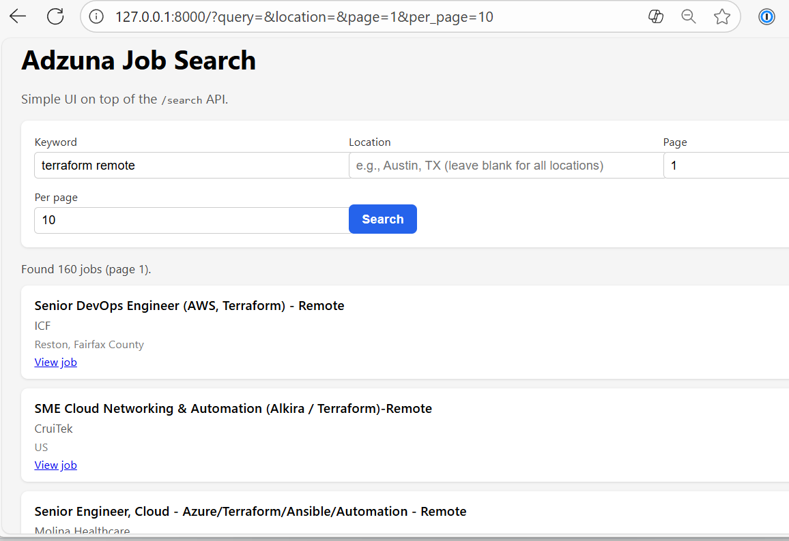

# adzuna_job_search


A minimal FastAPI service that queries the Adzuna Job Search API and returns normalized job listings.
This MVP serves as a foundation for a broader job-market intelligence platform.
---
## Overview
This project currently includes:
- A simple **FastAPI** backend
- A `/health` endpoint for uptime checks
- A fully implemented `/search` endpoint that proxies the Adzuna Job Search API and returns normalized job listings (with pagination, filtering, and schema validation)
- Configuration via `.env` using **Pydantic v2** + `pydantic-settings`
- An HTTP client implemented using **httpx**
- Basic automated tests using **pytest**
- Pre-commit DevSecOps tooling (formatting, linting, secret scanning)
The service is intentionally lightweight and will expand over time with frontend, infrastructure, and deeper DevSecOps integrations.
---
### Recent Improvements
#### Continuous Integration (CI)

A GitHub Actions workflow now runs on every push and pull request, including:

- **Ruff** lint checks
- **Pytest** test suite
- **detect-secrets** baseline scan

This ensures consistent code quality and helps prevent accidental secret commits.

---

#### Simple Frontend UI (Jinja2)

A lightweight HTML interface, rendered via **Jinja2 templates**, was added to provide a simple way to interact with the `/search` endpoint. The UI allows users to:

- Enter keywords and location
- Control pagination (`page` and `per_page`)
- View normalized job listings returned by the API

A small JavaScript snippet performs client-side requests and displays results directly on the page.

This offers a clean MVP frontend for exploring Adzuna job data without needing curl or Postman.

---
## Tech Stack
- Python 3.11
- FastAPI
- httpx
- Pydantic v2 + pydantic-settings
- pytest
- pre-commit (black, ruff, detect-secrets)
- Adzuna Job Search API
---
## Running Locally (Test Mode)
### 1. Clone the repository
```bash
git clone https://github.com/dgdemo/adzuna_job_search.git
cd adzuna_job_search
```
### 2. Create a .env file with your Adzuna credentials
``` text
ADZUNA_APP_ID=your_id
ADZUNA_APP_KEY=your_key
```
### 3. Create a virtual environment & install dependencies
``` bash
python -m venv .venv
source .venv/Scripts/activate    # Windows (Git Bash)
# source .venv/bin/activate      # macOS/Linux
pip install -r requirements.txt
```
### 4. Start the FastAPI server with uvicorn
``` bash
uvicorn app.main:app --reload
The server will be available at:
    • http://127.0.0.1:8000/
    • http://127.0.0.1:8000/health
    • http://127.0.0.1:8000/docs
```

### Example Search
http://127.0.0.1:8000/search?q=devsecops&location=Austin,TX&page=1&per_page=20


## Development Tooling
### Running tests

``` bash
pytest
```
### Pre-commit hooks
This project uses **pre-commit** for formatting, linting, and secret scanning.

Installed hooks:

    • black — code formatting
    • ruff — linting & autofix
    • detect-secrets — prevents accidental secret commits
    • Whitespace cleanup hooks


To run all hooks manually:
``` bash
pre-commit run --all-files
```

### Roadmap (Short-Term)
    • Add more search filters (salary range, category, remote)
    • Add Docker support for local development + lightweight deployment
    • Add GitHub Actions CI (linting, tests, secret scanning)
    • Add integration tests with mocked Adzuna API
    • Add optional live integration test against real Adzuna API

## UI Preview

<details>
  <summary>Click to expand screenshot</summary>

  

</details>
